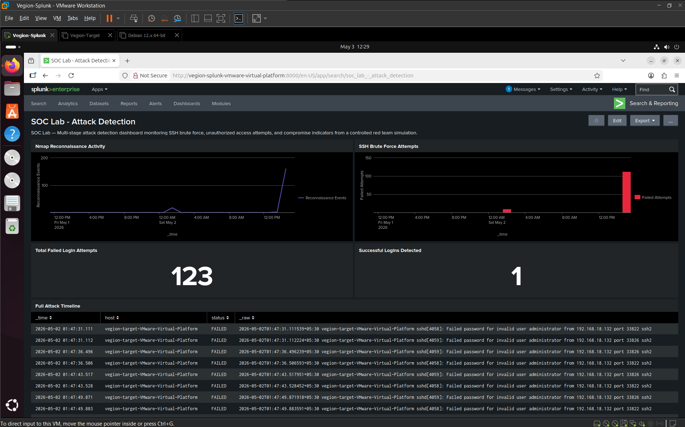

# Attack Simulation Walkthrough

This document provides a step-by-step walkthrough of the attack simulation performed in this SOC lab, including commands executed, expected outputs, and evidence screenshots.

---

## Lab Environment Verification

Before starting the attack simulation, verify all machines are running and communicating.

### Step 1 — Check IP Addresses

**On Kali (Attacker):**
```bash
ip a
```
**Result:** Kali IP = `192.168.18.132`

**On Ubuntu Target (Victim):**
```bash
ip a
```
**Result:** Ubuntu IP = `192.168.18.128`

### Step 2 — Verify Connectivity
**On Kali:**
```bash
ping -c 4 192.168.18.128
```
**Expected Result:** 4 packets transmitted, 4 received — target is reachable.

### Step 3 — Verify Splunk Forwarder is Running
**On Ubuntu Target:**
```bash
sudo systemctl status SplunkForwarder
```
**Expected Result:** `active (running)` — logs are being forwarded to Splunk.

📸 Evidence:
[](screenshots/Target%20Sending.png)

---

## Phase 1 — Reconnaissance (T1046)

The attacker performs network scanning to discover open ports and services on the target machine before launching any attack.

### Step 4 — Host Discovery Scan
**On Kali:**
```bash
nmap -sn 192.168.18.128
```
**What this does:** Sends ping probes to check if the target is alive without scanning ports.

**Result:** Host is up, MAC Address confirmed.

### Step 5 — SYN Stealth Scan
**On Kali:**
```bash
sudo nmap -sS 192.168.18.128
```
**What this does:** Sends SYN packets to each port without completing the TCP handshake — stealthy scan that reveals open ports.

**Result:** Port 22/tcp open — SSH discovered.

### Step 6 — Service Version Detection
**On Kali:**
```bash
sudo nmap -sV 192.168.18.128
```
**What this does:** Probes open ports to determine what service and version is running — critical for identifying exploitable vulnerabilities.

**Result:** OpenSSH 9.6p1 Ubuntu identified on port 22.

📸 Evidence (Steps 4-6):
[](screenshots/Kali%20Nmap.png)

### Step 7 — Aggressive Full Scan
**On Kali:**
```bash
sudo nmap -A 192.168.18.128
```
**What this does:** Combines OS detection, version detection, script scanning and traceroute — gives the attacker maximum information about the target.

**Result:** OS: Linux 4.15-5.19, Device: general purpose, SSH fully fingerprinted.

📸 Evidence:
[](screenshots/Kali%20Nmap%201.png)

**Reconnaissance Conclusion:** Target is running Ubuntu Linux with SSH (port 22) exposed. OpenSSH version identified. Attacker now knows exactly what to attack.

---

## Phase 2 — Credential Access (T1110.001)

With SSH identified as the attack surface, the attacker launches a brute force attack to guess the password.

### Step 8 — Verify SSH is Running on Target
**On Ubuntu Target:**
```bash
sudo systemctl status ssh
```
**Expected Result:** `active (running)` on port 22.

### Step 9 — Launch SSH Brute Force with Hydra
**On Kali:**
```bash
hydra -l vegion-target -P /usr/share/wordlists/rockyou.txt ssh://192.168.18.128 -t 4 -V
```

**What each flag means:**
- `-l vegion-target` — target username discovered during recon
- `-P rockyou.txt` — password wordlist with 14 million common passwords
- `-t 4` — 4 parallel threads
- `-V` — verbose output showing each attempt

**What this does:** Systematically tries every password in the wordlist against the SSH service until it finds the correct one or exhausts all options.

**Result:** 123 failed attempts recorded in auth.log before attack was stopped.

📸 Evidence:
[](screenshots/Kali%20Hydra.png)

---

## Phase 3 — Initial Access (T1078)

After brute force generates enough failed attempts, the attacker manually logs in using the correct credentials.

### Step 10 — Successful SSH Login
**On Kali:**
```bash
ssh vegion-target@192.168.18.128
```
**Result:** Successful login — attacker now has shell access to the target machine.

📸 Evidence:
[](screenshots/Kali%20Success%20SSH.png)

**Attack chain complete:** Recon → Brute Force → Unauthorized Access

---

## Phase 4 — Detection in Splunk

All attack activity was captured in Splunk via the Universal Forwarder running on the target machine.

### Step 11 — Verify Logs in Splunk

**SPL Query — View all attack events:**
```spl
index=linux sourcetype=linux_secure
```
**What this does:** Retrieves all logs forwarded from the target machine.

### Step 12 — Detect Nmap Reconnaissance
**SPL Query:**
```spl
index=linux sourcetype=linux_secure
| search _raw="*scan*" OR "*nmap*" OR "*port*"
| timechart span=1h count as "Reconnaissance Events"
```
**What this detects:** Unusual port-related connection attempts indicating scanning activity.

📸 Evidence:
[](screenshots/Splunk%20Nmap%20read.png)

### Step 13 — Detect SSH Brute Force
**SPL Query:**
```spl
index=linux sourcetype=linux_secure "Failed password"
| stats count as failed_attempts by host
| where failed_attempts > 10
| sort -failed_attempts
```
**What this detects:** Any host with more than 10 failed SSH login attempts — a clear indicator of brute force activity.

**Result:** `vegion-target-VMware-Virtual-Platform` — 123 failed attempts detected.

📸 Evidence:
[](screenshots/Splunk%20see%20Hydra.png)

📸 Evidence:
[](screenshots/Splunk%20Brute%20force%20detect.png)

📸 Evidence:
[](screenshots/Splunk%20see%20Host%20Hydra.png)

### Step 14 — Detect Successful Login
**SPL Query:**
```spl
index=linux sourcetype=linux_secure "Accepted password"
| table _time, host, _raw
| sort _time
```
**What this detects:** Any successful SSH login — when seen after brute force activity, this confirms a compromise.

**Result:** 1 successful login at `2026-05-02T15:20:59` from `192.168.18.132`

📸 Evidence:
[](screenshots/Splunk%20Success%20SSH.png)

📸 Evidence:
[](screenshots/Splunk%20success.png)

### Step 15 — Full Attack Timeline
**SPL Query:**
```spl
index=linux sourcetype=linux_secure ("Failed password" OR "Accepted password")
| eval status=if(match(_raw,"Failed"),"FAILED","SUCCESS")
| table _time, host, status, _raw
| sort _time
```
**What this does:** Combines all failed and successful login events into a single chronological timeline with clear FAILED/SUCCESS labels — showing the complete attack chain in one view.

📸 Evidence:
[.png)](screenshots/All%20Attack%20event%20(eval%20and%20tables).png)

---

## Phase 5 — Dashboard

A 5-panel Splunk dashboard was built to visualize the complete attack chain.

### Panel Overview

**Panel 1 — Nmap Reconnaissance Activity**
- Visualization: Line chart
- Shows reconnaissance events over time
- Spike indicates active scanning period

**Panel 2 — SSH Brute Force Attempts**
- Visualization: Column chart
- Shows failed login attempts over time
- Large red bar indicates brute force attack

**Panel 3 — Total Failed Login Attempts**
- Visualization: Single value
- Shows total count: 123 failed attempts

**Panel 4 — Successful Logins Detected**
- Visualization: Single value
- Shows total count: 1 successful login = compromise confirmed

**Panel 5 — Full Attack Timeline**
- Visualization: Table
- Shows chronological FAILED/SUCCESS events with raw log data

📸 Evidence:
[](screenshots/Dashboard.png)

---

## Summary

| Phase | Action | Tool | MITRE ID | Detected |
|---|---|---|---|---|
| Reconnaissance | Network port scanning | Nmap | T1046 | ✅ Yes |
| Credential Access | SSH brute force | Hydra | T1110.001 | ✅ Yes |
| Initial Access | Successful SSH login | SSH | T1078 | ✅ Yes |

All three phases of the attack were successfully detected using Splunk SPL queries and visualized in the SOC detection dashboard.